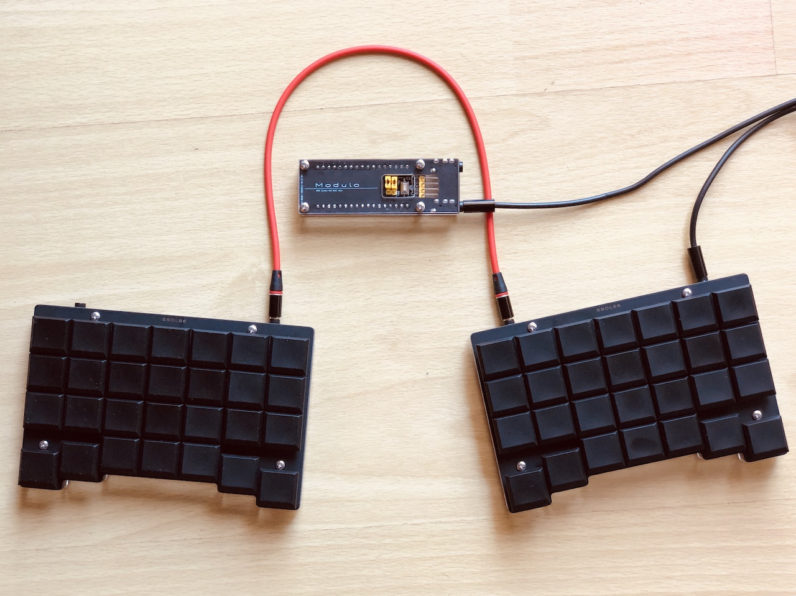

# 分割キーボードSSOL56

SSOL56は左右分割型の56キーのキーボードです。いろいろなコンセプトの検証のために作ったキーボードです。

## 特徴

- biacco42氏提唱のModuloアーキテクチャに準拠しています。ただし無線化には対応しません。
- Otholinearレイアウトをベースにしていますが、親指キーは自然に打てるレイアウトに変更しました。
- 一般的な19mmピッチより狭いキーピッチを試すために、ロープロファイルキースイッチとキーキャップを使用して、横18mm、縦17mmピッチで配置しています。Helix Picoと同じです。

## 設計

- biacco42氏のリファレンス設計を基にしており、使用している部品もTCA9555など、ほぼ同じです。
- Moduloアーキテクチャに忠実に従えば、TRRSはINT信号も含めた2個で1セットですが、今回は無線化する予定はなく、スペースも限られているので、INT信号は省略しました。
- Kailh low profileスイッチ専用です。ソケットに対応しています。
- 設計を容易にするためリバーシブル基板はやめ、また左右の基板を共通にするため、キーレイアウトは左右対称にしました。

## 写真

